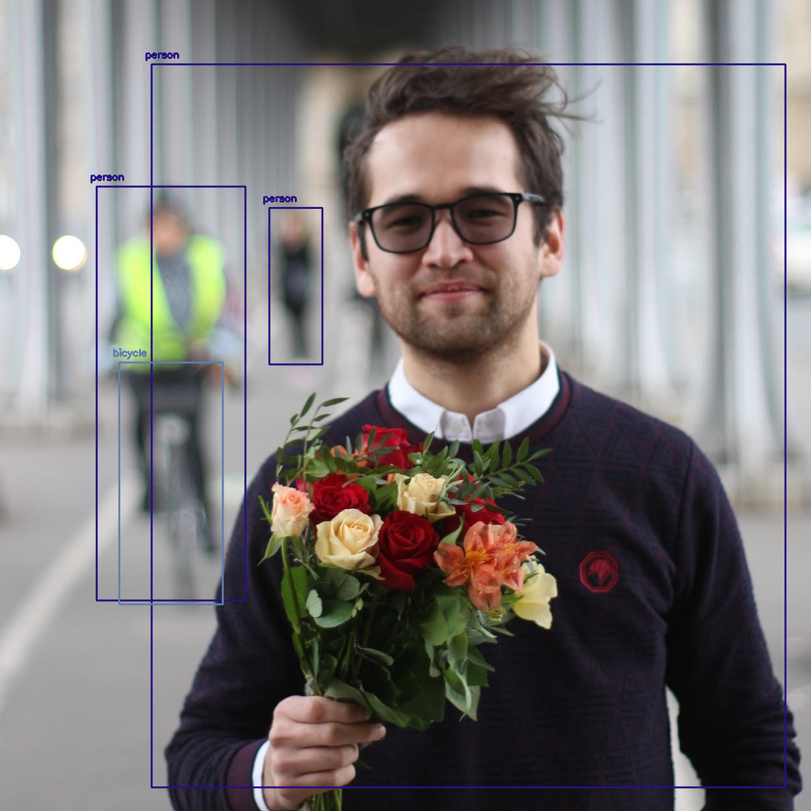

# Object-Detection-using-Deep-Learning
Object detection using deep learning with OpenCV and Python

## Popular object detection framework YOLO(You Only Look Once) used
## Install following:
- opencv
- numpy

```
pip install numpy opencv-python
```

## YOLO
Download the pre-trained YOLO v3 weights file from this link and place it in the current directory or you can directly download to the current directory in terminal using
```
$ wget https://pjreddie.com/media/files/yolov3.weights
```
Provided all the files are in the current directory, below command will apply object detection on the input image ``whatever.jpg``



